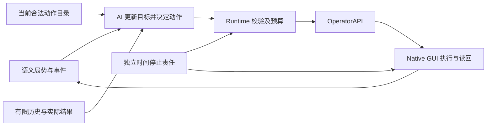

# HOI4 国家自治目标与后续路线

2026-10-07。项目仍保持原五阶段结构；下面是能力里程碑和产品验收计划，不新增 Phase 编号。本文件的扩展能力尚未实现，也不扩大本轮实机授权。

最终目标：用户交给 AI 一个国家和目标，AI 持续读取局势、制定并更新计划，经合法语义动作执行、验证结果、推进时间，并在异常时可靠停止。用户可以暂停、查看理由和接管；正常运行不需要人代替 AI 选科研、国策、生产或军事动作。

当前代码距离这个目标还有明显缺口。ScriptedAgent 是有限目录的确定性测试策略：basic_machine_tools、Rhineland、Kar98k 目标12、state64 单项民工等；历史 seven-action 7/7 证明这些受限动作路径。它不具备完整国家经营策略。真实 Codex 尚未通过 provider/action/multi-cycle gate；未知数据也不能被模型补成事实。

## 当前 Phase 5 先完成的基础

依序完成 Time Safety → Construction mutation → 新30天 Scripted 稳定性 → 真实 Codex 首个 confirmed semantic action → 3–5 个有限战略周期。旧失败原始记录保留；无动作只计 valid no-op。没有 verified readback、未确认暂停或有人工安全干预的运行，不能算无人自治通过。

模型继续只获得 Strategic Observation、Action Catalog、Goals、Limited History。正常 HOI4 GUI 由 OperatorAPI 和 WindowsNativeBackend 操作；截图、坐标、模板、HWND/PID 与输入原语由私有执行层管理。Computer Use pump 本轮保持 OFF。

## 德国和平期的首个可玩版本

建议固定现有版本、汉化、分辨率和 Germany 1936，先证明能独立经营180游戏日。新增能力按一个观察域、一组合法动作、真实读回逐项验收，不在当前时间安全修复中顺手实现。

| 能力 | 当前限制 | 需要形成的闭环 |
|---|---|---|
| 科研 | 少数 tracked predicates；单个推荐目标 | 读到实际槽位、合法科技和先修条件；选择下一项；完成后继续安排，记录闲置时长 |
| 国策 | Rhineland predicate，后续目标未覆盖 | 枚举可选国策和条件、记录实际完成；AI 按国家目标选择后续国策 |
| 建设 | state64/count1/空队列；可用容量不完整 | 读取州身份、剩余槽位、基础设施与队列；在已验证合法目标中持续分配，避免已满州和重复建设 |
| 生产 | 首条装备、工厂10/11/12；固定目标12 | 读取装备缺口、库存、现有线、产出和可用工厂；调整多条生产线；先明确哪些字段能可靠观察 |
| 政治与经济 | strategic 默认缺顾问、贸易等完整观察 | 可靠读取资源缺口、可选法案/顾问、政治点和贸易；逐项增加正常GUI语义动作与限制 |
| 事件与弹窗 | 仅少数识别与停止路径 | 区分可安全确认的信息事件、需要战略选择的事件、未知弹窗；时间控制不负责偷偷替 AI 选事件 |

先扩充可靠的语义观察和可用动作，再让模型在目录内选择。可通过既有只读 telemetry 机制扩充的数据，需要核对安装版本允许的只读查询；脚本不能提供的字段继续标 UNKNOWN，由确定性 GUI reader 补充。禁止用 effect、console、内存写入或改 save 代替实际操作。

Goals 应逐步从固定测试目标变成国家经营目标，例如维持科研/国策连续性、满足关键装备需求、发展工业、管理资源和预备军力。模型提出策略，Runtime 负责 schema、目录、freshness、身份、预算和重复提案检查，Executor 负责最终 GUI 真值。不要把固定工厂数或高动作次数当成战略质量。

## 证明 AI 的决策有用

在相同专用测试基线、相同游戏日数与权限下，比较不操作基线、Scripted 策略和真实 AI。模型决定具体合法动作，人工只负责启动和预先设定目标，不中途替它选策略。

同时报告：科研/国策闲置、产线与资源缺口、工厂利用、建设完成、目标进展、动作成功率、重复提案、无动作原因、模型耗时和调用成本（可获得时）。未知字段不能参与“已达目标”统计。

无动作可能是正确决策，也可能是目录耗尽。记录 available actions 数量、被阻挡原因、策略覆盖缺口和 no-op 理由；需要行动却连续 no-op，应暴露为产品缺口。先按完整30天、90天、180天逐步扩大时长。验收包含多个有意义的决策领域及其 confirmed mutation，且无人工战略或安全干预，不只看日期。

## 从经营到战争

在和平期可玩版本通过后，选择一个限定陆战场景，建立完整军队/师团身份、训练与部署、装备与补给、前线、计划执行/停止和结果观察。现有“建立前线/进攻线”验收没有证明能自行打赢战争，也没有覆盖整支军队。

AI 需要根据实际补给、损失、战线变化和目标调整作战计划；所有军事动作仍来自合法目录并有确定性读回。先验证一段陆战，再验收更长战役。空军、海军和外交/宣战属于之后的独立能力工作，本轮不扩展。

## 扩展到其他国家

国家差异应进入 country profile：合法国策、初始资源和军力、战略目标、语言/版本约束，以及已验证的 GUI 身份/地图目标。国家 profile 不应靠复制一套不可解释的固定鼠标坐标运行。

在两个以上国家分别通过真实局势读取、动作覆盖和长期自治验收后，才能开始宣称多国支持。“任意国家、任意 camera/resolution/language”仍需独立工程与证据，当前不承诺已支持。

## 最终用户流程与可用标准

用户选择国家/专用测试存档、目标和运行预算，附加已启动的 HOI4，检查当前权限与能力后开始。运行界面显示游戏日期、当前目标、已确认结果、阻挡原因和停止状态；提供暂停和接管。程序重启或读档后重建 session、timeline、snapshots 和目录，不沿用旧身份。

保存/恢复未来通过用户授权的正常 GUI 写入新的专用 checkpoint，不覆盖原手动存档。审计应支持重放决策与查看私有 GUI proof；模型只看语义历史。

可以称为“AI 能自己玩一个国家”的最低证据是：在声明的国家、时期和能力范围内，AI 连续作出有用的跨领域决策并执行、验证，持续推进时间，处理已支持事件，遇到不支持情况准确停止；整段验收无需人工替选策略或代为安全暂停。先兑现这一范围，再扩大国家和战争能力。
